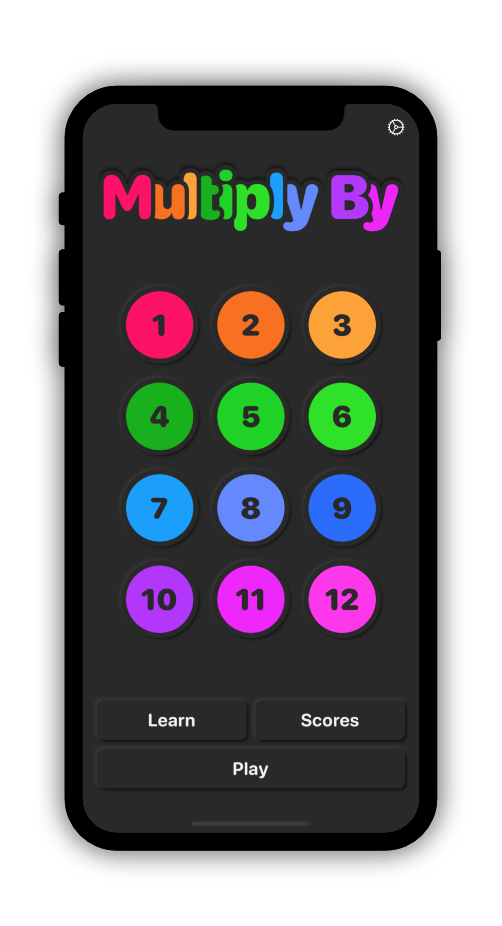

# MultiplyBy

Multiply By is an app to learn multiplications tables.

Tech Stack for this project:
- SwiftUI
- IOS 13, XCode 11
- CoreData and CloudKit
- Localization
- MVVM

The Model and ViewModel code coverage for test is 100%

For each of the screens presented below, there is a Light Mode version and a Dark Mode one.

## Home Screen

This is the view you see when you open the app. From there you can choose the tables you want to train on by tapping the corresponding numbers. (by default they are all selected at the first start)

  
   

On the screenShots below you can see how it renders when tables 6, 7, 8, 9, 12 are selected.

  
  

## Game Screen

This is the in game view, you have 60 seconds to answer the more questions you can.

  
  

## Learn Screen

This is where you can learn the tables you have selected. You scroll horizontally for next table.

  
  

## Gameover Screen

This is the view that pop up when you finished a game. It displays your score.

  
  

## Scores Screen

This screen provides you infos about your past scores. You can find your best and worst scores but also your average score.
A graph display all your games scores from the oldest to the newest so you can see your progress.

 

  
  

## Settings Screen

This screen provides you the possibility to change the language of the app and also to save your selection of tables.

  
  

