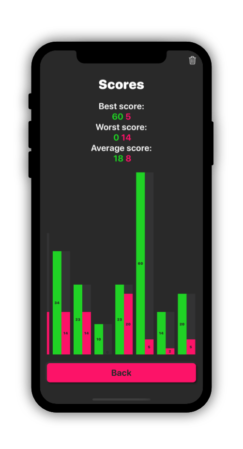

# MultiplyBy

Multiply By is an app to learn multiplications tables.

- SwiftUI
- IOS 13, XCode 11
- CoreData and CloudKit

<table>
  <tr>
    <td align="center"><b>LightMode</b></td>
     <td align="center"><b>DarkMode</b></td>
  </tr>
  <tr>
    <td align="center" colspan="2"><b>homeView</b></td>
    </tr>
    <tr>
     <td align="center" colspan="2">This is the view you see when you open the app. From there you can choose the tables you want to train on by tapping the corresponding numbers. (by default they are all selected at the first start)</td>
    </tr>
  <tr>
    <td></td>
    <td></td>
  </tr>
  <tr>
    <td align="center" colspan="2">game</td>
    </tr>
  <tr>
   <tr>
    <td></td>
    <td></td>
  </tr>
   <tr>
    <td align="center" colspan="2">learn</td>
    </tr>
  <tr>
   <tr>
    <td></td>
    <td></td>
  </tr>
   <tr>
    <td align="center" colspan="2">gameover</td>
    </tr>
  <tr>
   <tr>
    <td></td>
    <td></td>
  </tr>
  <tr>
    <td align="center" colspan="2">scores</td>
    </tr>
   <tr>
    <td></td>
    <td></td>
  </tr>
  
 </table>
